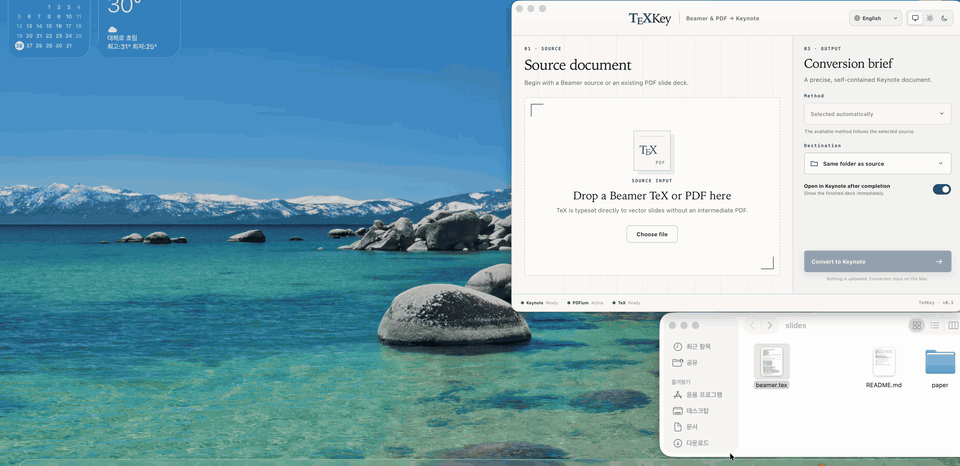

# TeXKey — Beamer and PDF to Keynote

TeXKey is a native macOS application for translating Beamer sources and
existing PDF slide decks into Apple Keynote documents. Its interface is built
with Tauri, while document analysis and conversion are implemented in Rust.
PDF conversion is self-contained. Direct Beamer conversion uses a MacTeX
installation on the same Mac.

## Direct Beamer rendering



When given a Beamer `.tex` source, TeXKey typesets the presentation with
XeLaTeX or LuaLaTeX and sends its XDV or DVI output directly to dvisvgm. It
constructs vector Keynote slides without producing an intermediate PDF.

For existing PDFs, TeXKey offers two complementary interpretations:

- **Editable text** retains the non-textual page as a vector PDF layer and
  reconstructs textual material as native Keynote text objects.
- **Exact appearance** places each complete PDF page as a single sharp image
  layer, avoiding font substitution and object displacement.

The converter preserves character-level Unicode, typeface, size, colour,
position, and rotation. Mathematical characters represented by UTF-16
surrogate pairs are retained. Before conversion, TeXKey examines the source,
the fonts available to macOS, and the local Keynote environment.

The interface follows the user’s locale in English or Korean. Its appearance
may follow macOS—the default—or be fixed to light or dark mode.

## Font handling for editable PDFs

Keynote does not expose a public API for embedding editable fonts inside a
`.key` document. TeXKey therefore includes the OFL-licensed Libertinus family
and installs it in the user font directory when required. The original
non-textual PDF layer remains in the Keynote document, preserving the visual
ground beneath reconstructed text.

If a PDF requires a font that is absent from the current Mac, TeXKey checks
whether the PDF contains an actual embedded font program. Before an editable
conversion, it presents the missing fonts and asks whether they should be
extracted. The default action is to continue without extraction. Extraction
occurs only after explicit user consent.

The consent notice states the following risks:

- Inclusion in a PDF does not grant permission to install or reuse a font.
- A subset font may contain only the glyphs used by the PDF; newly entered
  characters may therefore fall back to another font.
- Untrusted font files may present a security risk. Extracted fonts are
  installed for the user account and remain after conversion.
- TeXKey installs only embedded OpenType or TrueType programs. Non-embedded
  fonts, Type 3 fonts, and unsupported formats are not extracted.

The exact-appearance mode does not require font extraction or installation.

## Runtime requirements

Apple Keynote is required for every conversion because TeXKey constructs the
finished `.key` document through Keynote automation.

PDF-to-Keynote conversion otherwise uses the PDFium framework bundled with
TeXKey and does not require a TeX installation.

Direct `.tex`-to-Keynote conversion requires a
[full MacTeX installation](https://www.tug.org/mactex/mactex-download.html). It
uses the system copies of XeLaTeX, LuaLaTeX, dvisvgm, Beamer, TikZ/PGF,
tcolorbox, and any other package imported by the source document. Install
MacTeX and the Ghostscript shared library used by dvisvgm:

```sh
brew install ghostscript
```

Then add the following line to the shell profile used by Terminal:

```sh
export PATH="/Library/TeX/texbin:$PATH"
```

### How TeXKey resolves these tools

TeXKey does **not** use the interactive shell PATH. GUI applications launched
from Finder do not inherit it, so TeXKey probes a fixed list of directories and
takes the first match:

```
/Library/TeX/texbin → /opt/homebrew/bin → /usr/local/bin → /usr/bin → /bin → /usr/sbin → /sbin
```

This order matters for `dvisvgm`, which both MacTeX and Homebrew provide. A
MacTeX copy in `/Library/TeX/texbin` always wins, even when Homebrew has a
newer one — and because most shells place `/opt/homebrew/bin` *before*
`/Library/TeX/texbin`, `dvisvgm --version` in Terminal can report a different
binary than the one TeXKey actually runs. Verify with explicit paths rather
than `command -v`:

```sh
for tool in xelatex dvilualatex kpsewhich dvisvgm; do
  for dir in /Library/TeX/texbin /opt/homebrew/bin /usr/local/bin /usr/bin; do
    [ -f "$dir/$tool" ] && { echo "$tool -> $dir/$tool"; break; }
  done
done
kpsewhich beamer.cls
kpsewhich pgf.sty
kpsewhich tikzlibraryfit.code.tex
kpsewhich tcolorbox.sty
test -f "$(brew --prefix ghostscript)/lib/libgs.dylib"
```

The `dvisvgm` line of that output is the binary TeXKey will use. Installing a
newer dvisvgm with Homebrew has no effect while a MacTeX copy shadows it; to
adopt the Homebrew build you must remove or upgrade the MacTeX one.

### dvisvgm version

Use a current dvisvgm. Beamer's rounded blocks leave PGF scopes open, and
TeXKey compensates by injecting closing `</g>` tags into the SVG stream.
Older dvisvgm releases reject the result and the conversion fails with:

```
슬라이드 벡터 렌더링에 실패했습니다: XML error: missing closing tag(s): </g>, </g>, </g>
```

dvisvgm 3.6, as shipped with TeX Live 2026, is verified working. If you see
this error, check which binary is being resolved by the rules above, then
upgrade MacTeX or replace the shadowing copy.

A full current MacTeX installation includes the TeX components. Its
Ghostscript command-line executable does not provide the shared `libgs`
library that dvisvgm loads for EPS and PostScript specials, so the Homebrew
Ghostscript installation is also required. Note that TeXKey 0.3.1 treats
`libgs` as a hard prerequisite: direct Beamer conversion stays disabled
without it, even for documents containing no EPS or PostScript specials that
would render identically without Ghostscript. If an existing minimal TeX Live
installation reports a missing package, install the corresponding TeX Live
package with `tlmgr`; TeXKey does not download or modify the system TeX
installation.

Dependency status is detected once at launch and cached for the lifetime of
the process. After installing MacTeX, dvisvgm, or Ghostscript, quit and
reopen TeXKey — a running instance keeps reporting the tools as missing and
leaves the convert button disabled.

### Two releases: BSD and GPL

TeXKey ships in two builds. Both share identical conversion code and produce
byte-identical slides; they differ only in what they redistribute.

| | BSD build | GPL build |
|---|---|---|
| Build command | `npm run build` | `npm run build:gpl` |
| dvisvgm | installed by you | **bundled** (3.6, universal) |
| Ghostscript | installed by you | **bundled** (libgs + closure) |
| MacTeX | required | **required** |
| Added bundle size | — | ~47 MiB |
| Licence of the distribution | BSD-3-Clause | GPLv3 / AGPLv3 obligations |

The **BSD build** redistributes no GPL-licensed program. dvisvgm is GPL-3.0-or-later
and Ghostscript is AGPL-3.0-or-later, so shipping either would impose source
conveyance duties on every download. Installing them yourself keeps the
released application free of those obligations — which is why the versions
present on each Mac have to be checked rather than assumed.

The **GPL build** accepts those obligations in exchange for removing the two
dependencies most prone to per-machine drift. It pins dvisvgm 3.6, so the
`missing closing tag(s): </g>` failure cannot occur, and removes the Ghostscript
install step entirely. Its notices and source offers live in
`src-tauri/resources/tex-engines/` and `src-tauri/resources/ghostscript/`.

**The GPL build is not self-contained.** It bundles a renderer, not a TeX
distribution: `xelatex`, `dvilualatex`, `kpsewhich`, and every package a
document imports still come from MacTeX. It removes two of the five
dependencies, not all five.

Ghostscript is optional in both builds. It is consulted only for EPS and
PostScript specials; a document containing none renders identically without
it, so a missing `libgs` no longer blocks conversion.

Run `sh scripts/vendor-ghostscript.sh` to populate the Ghostscript closure
before a GPL build — `npm run build:gpl` does this for you. The vendored
libraries are build output and are not tracked in git.

This covers ordinary Beamer, TikZ/PGF, PGFPlots, tcolorbox, and `listings`
documents. Features that launch non-TeX programs remain external requirements:
for example `minted` needs Python and Pygments, and gnuplot-backed plots need
gnuplot. TeXKey itself does not use Python, bundle gnuplot, or enable these
external execution workflows.

### Reproducing the original Beamer appearance

To reproduce a PDF previously built from the same Beamer source, the
conversion Mac must provide the same TeX package versions, system fonts,
project-local `.sty` files, images, and other source assets that were used for
the original build. Differences in that typesetting environment can change
font metrics, line breaks, and layout.

TeXKey converts the resulting XDV or DVI glyphs directly to SVG outlines.
LuaLaTeX documents use `dvilualatex`, not a LuaLaTeX-generated PDF. Once the
Keynote document has been created, those outlined glyphs preserve their
appearance on another Mac without requiring the original TeX fonts. When an
existing PDF is the visual source of truth, the exact-appearance PDF mode
provides the strongest reproduction because it does not re-typeset the Beamer
source.

## System requirements

- Apple Silicon Mac running macOS 12 or later
- Apple Keynote
- MacTeX for direct Beamer `.tex` conversion, supplying XeLaTeX, LuaLaTeX,
  `kpsewhich`, and the packages each document imports
- A current dvisvgm — 3.6 (TeX Live 2026) verified; older builds can fail with
  `XML error: missing closing tag(s): </g>`
- Homebrew Ghostscript, required at launch by 0.3.1 and functionally needed
  for EPS/PostScript-to-SVG rendering
- Rust, Node.js, and Xcode Command Line Tools for development builds

All four tool dependencies are resolved from a fixed directory list, not from
the shell PATH; see [How TeXKey resolves these tools](#how-texkey-resolves-these-tools).

## Building from source

A source build requires Git, the stable Rust toolchain, a current Node.js LTS
release, npm, and Xcode Command Line Tools. The checked-in PDFium framework
presently targets Apple Silicon.

Begin with a clean checkout:

```sh
git clone https://github.com/nllerpark/beamer-to-keynote.git
cd beamer-to-keynote
npm ci
```

Run the development application:

```sh
npm run dev
```

Create an unsigned local test distribution:

```sh
npm run build:unsigned
```

Unsigned artifacts are for local development and QA only. Gatekeeper will
reject an unsigned download and may show a warning that Apple cannot check it
for malicious software. TeXKey cannot display recovery instructions from
inside the app because Gatekeeper blocks the process before it launches. Do
not distribute an unsigned artifact to end users.

The resulting application and DMG are written below
`src-tauri/target/aarch64-apple-darwin/release/bundle/`. Building the app
itself does not require MacTeX, but direct Beamer conversion in the resulting
application does.

## Source release archive

Every TeXKey release should publish the source archive generated from the same
Git commit as its binary artifacts:

```sh
npm run package:source
```

This produces `TeXKey_<version>_source.tar.gz` and its SHA-256 checksum below
`src-tauri/target/aarch64-apple-darwin/release/bundle/source/`. For a public
release, run the command from the tagged, clean commit and attach both files to
the release. Hosting services may also provide their own automatic archives
for the tag.

This archive contains the TeXKey repository at the selected commit.

## Signed macOS builds

Build the signed BSD-licensed application:

```sh
npm run build
```

Artifacts are written below
`src-tauri/target/aarch64-apple-darwin/release/bundle/`. The build uses the
configured ITRIX Developer ID identity to sign the application and DMG. The
regular build command does not submit the result for Apple notarization.
End-user releases must use the notarized release command below.

Create a notarized end-user release:

```sh
xcrun notarytool store-credentials TeXKey \
  --apple-id "APPLE_ID" \
  --team-id "D5UUNR2X89"

APPLE_NOTARY_PROFILE=TeXKey npm run release:macos
```

The release script builds and signs the application, creates the source
archive and checksum, submits the DMG, waits for Apple’s response, staples the
ticket, and verifies the resulting artifact with both `codesign` and
Gatekeeper. It fails before building when the configured Developer ID
Application certificate and private key are not installed.

## Repository structure

- `src/` — the Stitch-informed macOS interface and locale resources
- `src-tauri/src/pdfium_engine.rs` — character-level PDF reconstruction
- `src-tauri/src/tex_engine.rs` — direct DVI/XDV-to-vector Beamer rendering
- `src-tauri/resources/pdfium/` — the bundled PDFium engine and notices
- `src-tauri/resources/fonts/` — the bundled Libertinus family
- `keynote_editable_import.applescript` — native Keynote object construction

## Copyright and licences

Copyright © 2026 Park Junhu (`nller.park@snu.ac.kr`).

TeXKey source code is distributed under the
[BSD 3-Clause License](LICENSE). Bundled PDFium and fonts retain their own
licences; their notices are included with the application. MacTeX, XeLaTeX,
LuaLaTeX, dvisvgm, Ghostscript, and TeX packages are system dependencies and
are not redistributed inside TeXKey.
